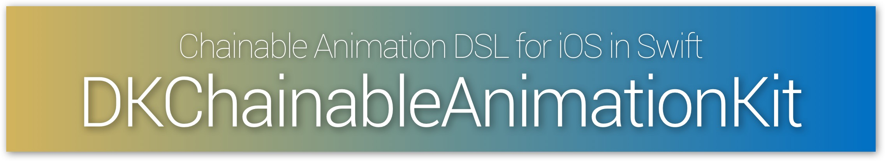

**DKChainableAnimationKit** is a DSL to make animation easy on iOS with **Swift**. 

This is a swift port for JHChainableAnimations by [jhurray](https://github.com/jhurray).

# Demo


[](https://github.com/Carthage/Carthage)

<table>
<tr>
<td width="75%">
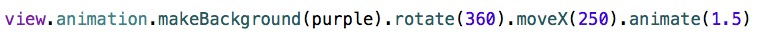</img>
</td>
<td width="25%">
</img>
</td>
</tr
<tr>
<td width="75%">
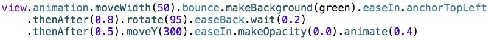</img>
</td>
<td width="25%">
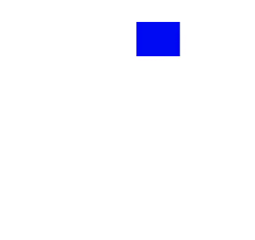</img>
</td>
</tr>
</table>

**If you app is written in Objective-C, you should use [JHChainableAnimations](https://github.com/jhurray/JHChainableAnimations) instead.**

## With JHChainableAnimation3s

```
view.makeScale()(2.0).spring().animate()(1.0)
```

## With DKChainableAnimationKit

Using DKChainableAnimationKit, you do not need to write the **extra parentheses**.

```
view.animation.makeScale(2.0).spring.animate(1.0)
```

# Installation with CocoaPods

[CocoaPods](https://cocoapods.org/) is a dependency manager for Objective-C, which automates and simplifies the process of using 3rd-party libraries like DKNightVersion in your projects. See the [Get Started section](https://cocoapods.org/#get_started) for more details.

## Podfile

```
use_frameworks!

pod "DKChainableAnimationKit", "~> 1.4.0"
```

# Installation with Carthage

[Carthage](https://github.com/Carthage/Carthage) is a depency manager for Objectiv-C and Swift. 

## Cartfile
```
github "Draveness/DKChainableAnimationKit"
```

# Usage

DKChainableAnimationKit is designed to be extremely easy to use. First call `animation` method on `UIView` instance, and then add the animation you want followed by a `animate(t)` method.


```
view.animation.moveX(100.0).animate(1.0)
```

## Animating

Chainable properties or functions like **`moveX(x)`** must come between the **`animate(duration)`** function.

```
view.animation.moveX(100.0).animate(1.0)
```

If you want mutiple animation at one time.

```
view.animation.moveX(100.0).moveY(100.0).animate(1.0)
```

This will move the view 100 point right and 100 point down at the same time. Order is not important.

## Chaining Animations

To chain animations separate the chains with the **thenAfter(duration)** function.

```
view.animation.moveX(100.0).thenAfter(1.0).makeScale(2.0).animate(2.0)
```

This will move the view for one second and after moving, it will scale for two seconds.

## Animation Effects

To add animation effect, call the effect method after the chainable property you want it to apply it.

Below is an example of moving a view with a spring effect.

```
view.animation.moveX(10).spring.animate(1.0)
```

If you add two animation effect, the first will be cancel out.

```
view.animation.moveX(10).spring.bounce.animate(1.0)
// The same as view.animation.moveX(10).bounce.animate(1.0)
```

## Anchoring

To anchor your view call an anchoring method at some point in an animation chain. And if you add two anchoring property, the first will be cancel like effects.

```
view.animation.rotate(180).anchorTopLeft.thenAfter(1.0).rotate(90).anchorCenter.animanimation
```

## Delay

To delay an animation call the **`wait(time)`** or **`delay(time)`** chainable function.

```
view.animation.moveXY(100, 40).wait(0.5).animate(1.0)
view.animation.moveXY(100, 40).delay(0.5).animate(1.0)
delay
```

This will move the view after 0.5 second delay.

## Completion

If you want to run code after an animation finishes, you are supposed to set the **`animationCompletion`** property or call **`animateWithCompletion(t, completion)`** function.

```
view.animation.makeX(0).animateWithCompletion(1.0, {
    println("Animation Done")
})
```

This is the same as

```
view.animation.animationCompletion = {
    println("Animation Done")
}
view.animation.makeX(0).animate(1.0)
```

And also the same as

```
view.animation.makeX(0).animate(1.0).animationCompletion = {
    println("Animation Done")
}
```

## Bezier Paths

You can also animate a view along a UIBezierPath. Call `bezierPathForAnimation` method first and then add points or curves to it and us it in a chainable property.

```
let path = view.animation.bezierPathForAnimation()
path.addLintToPoint(CGPoint(x: 30, y: 40))
view.animation.moveOnPath(path).animate(1.0)
```

Animation effects does not work on path movement.

----

# Chainable Properties

<table>

<tr>
<td width="20%">
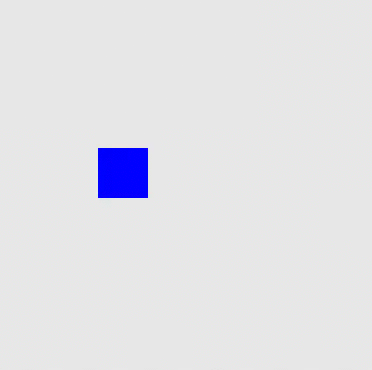</img>
</td>
<td width="80%">
<code>moveX(100.0)</code>
</td>
</tr>

<tr>
<td width="20%">
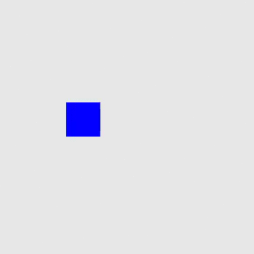</img>
</td>
<td width="80%">
<code>moveY(100.0)</code>
</td>
</tr>

<tr>
<td width="20%">
</img>
</td>
<td width="80%">
<code>moveWidth(100.0)</code>
</td>
</tr>

<tr>
<td width="20%">
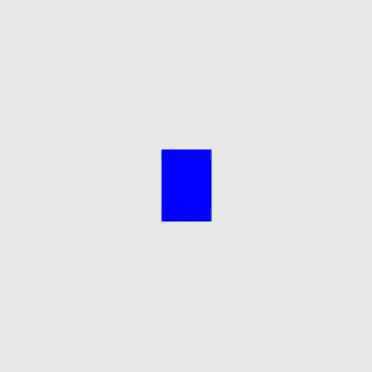</img>
</td>
<td width="80%">
<code>moveHeight(100.0)</code>
</td>
</tr>

<tr>
<td width="20%">
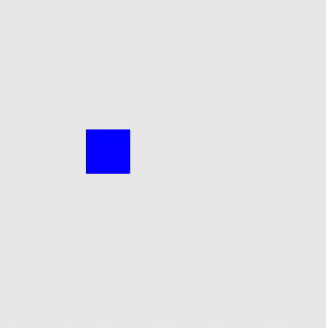</img>
</td>
<td width="80%">
<code>moveXY(100.0, 100.0)</code>
</td>
</tr>

<tr>
<td width="20%">
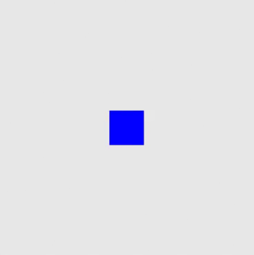</img>
</td>
<td width="80%">
<code>makeX(100.0)</code>
</td>
</tr>

<tr>
<td width="20%">
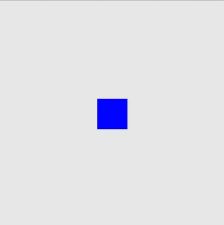</img>
</td>
<td width="80%">
<code>makeY(100.0)</code>
</td>
</tr>

<tr>
<td width="20%">
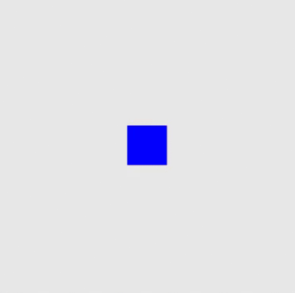</img>
</td>
<td width="80%">
<code>makeOrigin(100.0, 100.0)</code>
</td>
</tr>

<tr>
<td width="20%">
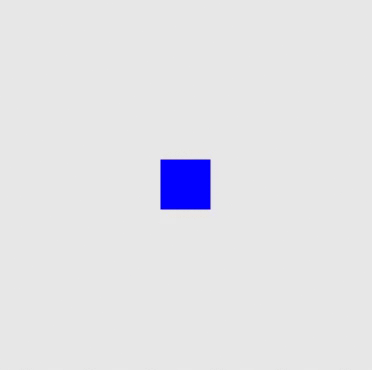</img>
</td>
<td width="80%">
<code>makeCenter(100.0, 100.0)</code>
</td>
</tr>

<tr>
<td width="20%">
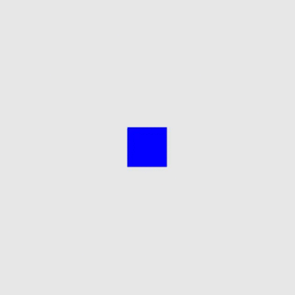</img>
</td>
<td width="80%">
<code>makeWidth(100.0)</code>
</td>
</tr>

<tr>
<td width="20%">
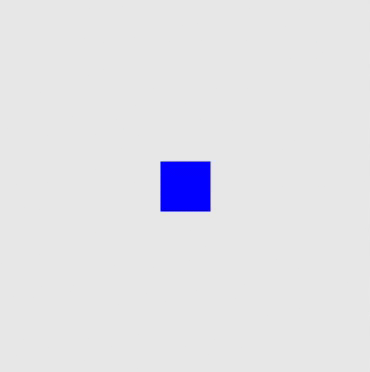</img>
</td>
<td width="80%">
<code>makeHeight(100.0)</code>
</td>
</tr>

<tr>
<td width="20%">
</img>
</td>
<td width="80%">
<code>makeSize(100.0, 100.0)</code>
</td>
</tr>

<tr>
<td width="20%">
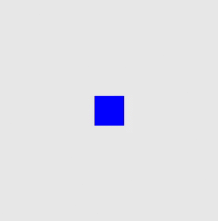</img>
</td>
<td width="80%">
<code>makeFrame(rect) // let rect: CGRect</code>
</td>
</tr>

<tr>
<td width="20%">
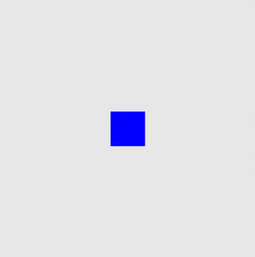</img>
</td>
<td width="80%">
<code>makeBounds(rect) // let rect: CGRect</code>
</td>
</tr>

<tr>
<td width="20%">
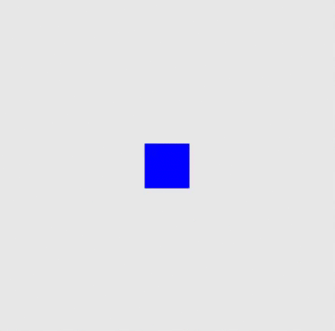</img>
</td>
<td width="80%">
<code>makeScale(2.0)</code>
</td>
</tr>

<tr>
<td width="20%">
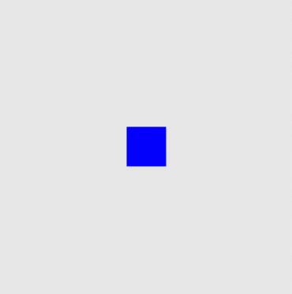</img>
</td>
<td width="80%">
<code>makeScaleX(2.0)</code>
</td>
</tr>

<tr>
<td width="20%">
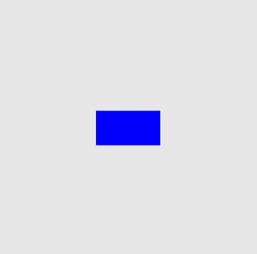</img>
</td>
<td width="80%">
<code>makeScaleY(2.0)</code>
</td>
</tr>

<tr>
<td width="20%">
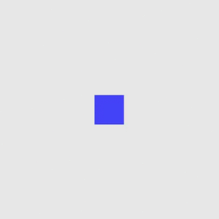</img>
</td>
<td width="80%">
<code>makeOpacity(0.0)</code>
</td>
</tr>

<tr>
<td width="20%">
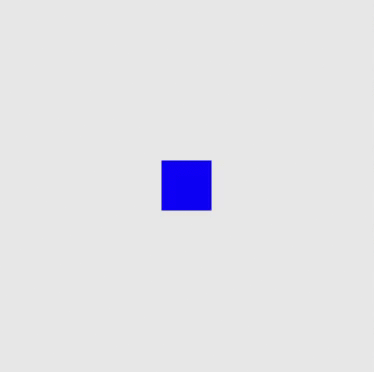</img>
</td>
<td width="80%">
<code>makeBackground(purple) // let purple: UIColor</code>
</td>
</tr>

<tr>
<td width="20%">
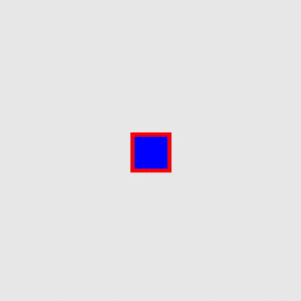</img>
</td>
<td width="80%">
<code>makeBorderColor(red) // let red: UIColor</code>
</td>
</tr>

<tr>
<td width="20%">
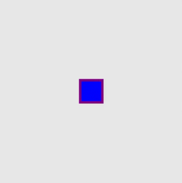</img>
</td>
<td width="80%">
<code>makeBorderWidth(10.0)</code>
</td>
</tr>

<tr>
<td width="20%">
</img>
</td>
<td width="80%">
<code>makeCornerRadius(25.0)</code>
</td>
</tr>
</table>

# To Do

* Support OS X
* Support Swift 2.0

----

# Contact

* If you have some advice open an issue or a PR.
* Email [Draveness](mailto: stark.draven@gmail.com?subject=DKChainableAnimationKit)

# License

DKChainableAnimationKit is available under the MIT license. See the LICENSE file for more info.
